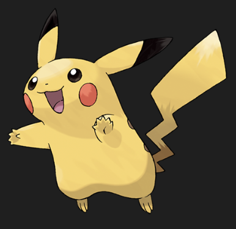
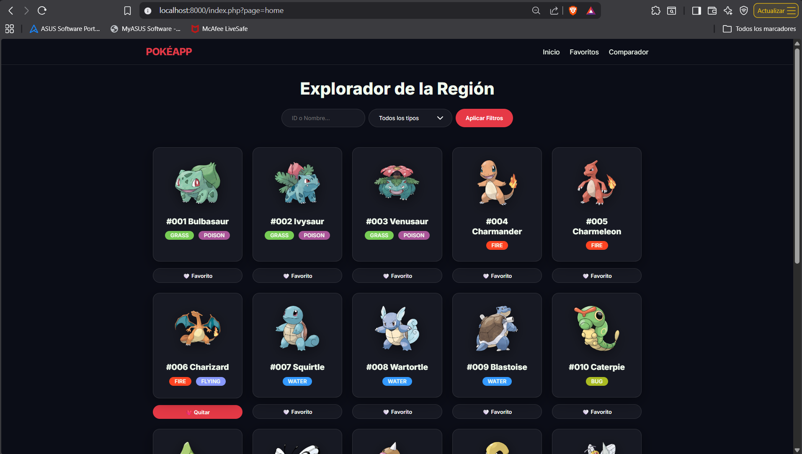
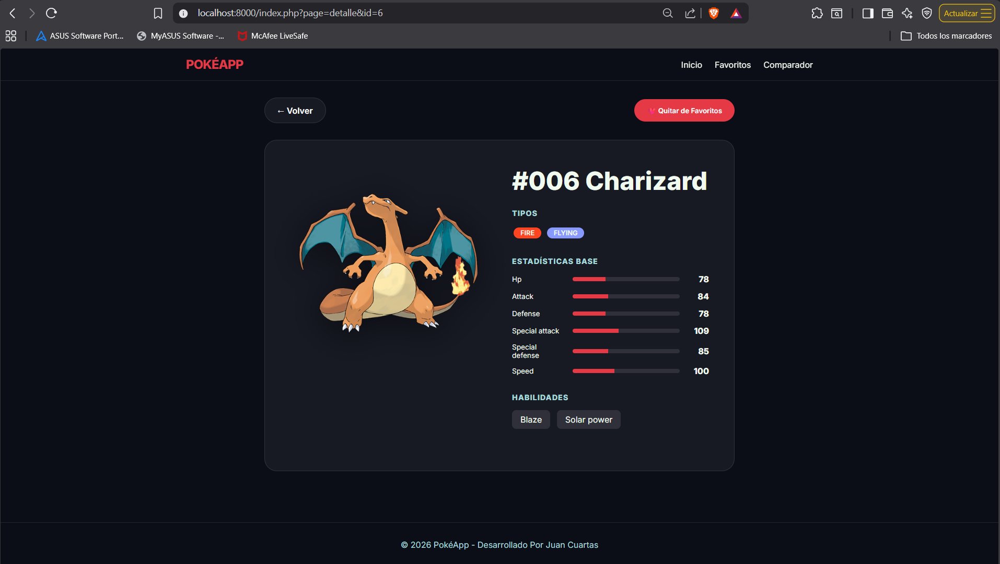

# PokéApp - Prueba Técnica

 <!-- Colocar aquí tu logo si lo tienes -->

Una aplicación web moderna y robusta desarrollada en **PHP 8.4 Vanilla** (sin frameworks) para listar, buscar, filtrar y gestionar Pokémon favoritos utilizando la **PokeAPI**.

## 🚀 Características Principales

- **Diseño Responsive & Dark Mode**: Interfaz premium con Glassmorphism, optimizada para móviles y escritorio.
- **Sistema de Caché Inteligente**: Caché en disco con TTL de 10 minutos para optimizar el consumo de la API y permitir navegación offline limitada.
- **Persistencia Robusta**: Gestión de favoritos mediante una base de datos **SQLite** autogestionada.
- **Buscador & Filtros**: Búsqueda por nombre/ID y filtrado avanzado por tipo de Pokémon.
- **Comparador**: Sección dedicada para comparar estadísticas base de dos Pokémon lado a lado.
- **Resiliencia Técnica**: Manejo de errores detallado y fallback de caché ante caídas de la API.

---

## 📸 Screenshots de la Aplicación

### 1. Inicio y Listado Paginado

*(Imagen del dashboard principal con la rejilla de Pokémon y filtros)*

### 2. Detalle de Pokémon

*(Vista técnica del Pokémon con sus stats en barras de progreso y habilidades)*

### 3. Comparador Side-by-Side

*(Comparativa visual de estadísticas entre dos Pokémon)*

---

## 🛠️ Requisitos Técnicos

- **PHP 8.1 o superior** (Se recomienda 8.4).
- **Extensión PDO SQLite** habilitada en el `php.ini`.
- **Composer** instalado para la gestión de autocarga (Autoload PSR-4).
- **Conexión a Internet** (la primera vez para llenar la caché).

---

## ⚙️ Instalación y Ejecución

1. **Clonar el repositorio**:
   ```bash
   git clone git@github.com:JuanCuartasE/PokeAPP.git
   cd PokeAPP
   ```

2. **Instalar dependencias (Autoload)**:
   ```bash
   composer install
   ```

3. **Iniciar el servidor local**:
   ```bash
   php -S localhost:8000
   ```
   *Accede a [http://localhost:8000](http://localhost:8000) en tu navegador.*

---

## 🏗️ Arquitectura del Proyecto

El proyecto sigue una estructura limpia basada en Programación Orientada a Objetos:

- **`src/CacheManager.php`**: Gestiona el almacenamiento y recuperación de archivos JSON en `/cache`.
- **`src/HttpClient.php`**: Wrapper para cURL con lógica de fallback ante errores de red.
- **`src/Database.php`**: Inicialización y gestión de la BD SQLite (`data/pokemon.sqlite`).
- **`views/`**: Plantillas HTML puras separadas por funcionalidad.
- **`index.php`**: Front Controller que gestiona el enrutamiento y la inyección de servicios.

---

## 📊 Decisiones de Diseño

- **Official Artworks**: Se utilizan los sprites de alta resolución para una experiencia visual superior.
- **Mobile First**: El CSS se diseñó pensando también en dispositivos móviles (< 375px).
- **Zero Frameworks**: Se implementa lógica de ruteo, persistencia y caché de forma nativa.

---

Desarrollado por **Juan Cuartas**.
